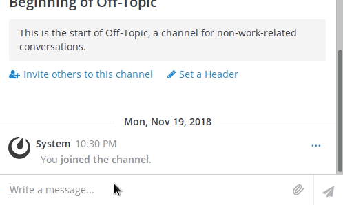
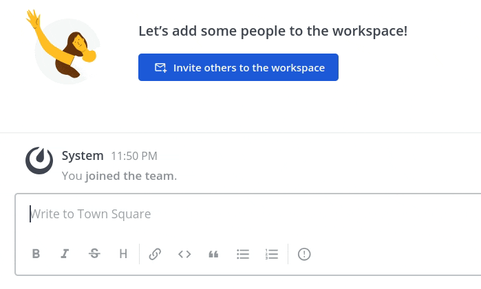
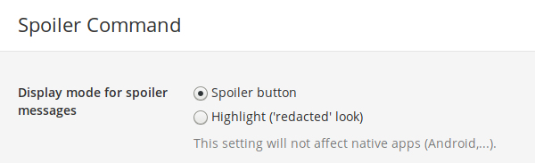

# Spoiler Plugin [](https://travis-ci.com/moussetc/mattermost-plugin-spoiler)

This plugin creates a slash command to display spoiler messages in a non-spoiling way.

## Compatibility
- This plugin is only compatible with **Mattermost versions 5.3 and higher.**

## Usage

Type `/spoiler` followed by your spoiler, then post your message. (The spoiler can be on more than one line, it can contain emojis, URLs, images, etc. All will be hidden.)

Two display modes are available for spoiler messages:
- **Spoiler button** mode:  


- **Redacted** mode:  
  
***This mode is not available on native apps like Android.*** Native apps do not yet support plugin customization, so for now they will use the *Spoiler button* mode.

## Installation and configuration
1. Download the [release package](https://github.com/moussetc/mattermost-plugin-spoiler/releases).
2. Use the Mattermost `System Console > Plugins > Management` page to upload the package
3. **Activate the plugin** in the `System Console > Plugins > Management` page
4. Choose the display mode: go to the System Console > Plugins > Spoiler Command, select the mode and save the plugin's settings.  
 


## Manual configuration
If you need to enable & configure this plugin directly in the Mattermost configuration file `config.json`, for example if you are doing a [High Availability setup](https://docs.mattermost.com/deployment/cluster.html), you can use the following lines:
```json
 "PluginSettings": {
        // [...]
        "PluginStates": {
            // [...]
            "com.github.moussetc.mattermost.plugin.spoiler": {
                "Enable": true,
		"SpoilerMode": "button"
            },
        }
    }
```

## Development
Build the plugin with the following command:
```
make
```
This will produce a single plugin package (with support for multiple architectures) in `dist/com.github.moussetc.mattermost.plugin.spoiler-X.X.X.tar.gz`

To automate deploying and enabling the plugin to your server, add the following lines at the beginning of the Makefile (it requires [http](https://httpie.org/) to be installed) and configure your admin login&password:
```
export MM_SERVICESETTINGS_SITEURL=http://localhost:8065
export MM_ADMIN_USERNAME=admin
export MM_ADMIN_PASSWORD=password
```
and use this command:
```
make deploy
```
