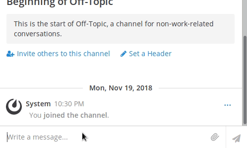
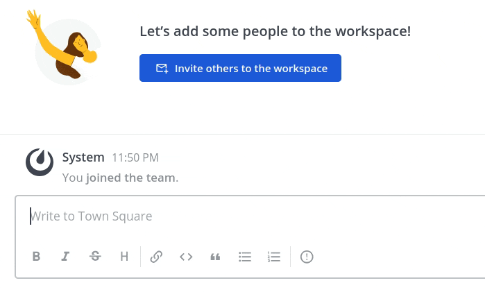
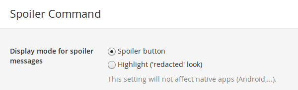

# Spoiler Plugin [](https://travis-ci.com/moussetc/mattermost-plugin-spoiler)

**Maintainer:** [@moussetc](https://github.com/moussetc)

This Mattermost plugin adds a `/spoiler` slash command to safely display messages with spoiler content.

## Examples

Type `/spoiler [message]` and post your message. The content of the message will be hidden by default.

Two display modes are available for spoiler messages:
- **Spoiler button** mode, that will work on all devices (default):  


- **Redacted** mode, that **does not work on Android&iOS apps** (the Spoiler button mode is used instead on those apps):  
  

| Works on | Doesn't work on |
| --- | --- | --- |
| single and multiline text | file attachments: they won't appear at all, due to a Mattermost limitation (cf. #12) |
| emojis |  |
| URLs & their preview | |
| inline images | |


## Compatibility

Use the following table to find the correct plugin version for your Mattermost server version:

| Mattermost server | Plugin release | Incompatibility |
| --- | --- | --- |
| 5.20 and higher | v3.1.x+ | breaking plugin manifest change |
| 5.14 to 5.19 | v3.x.x | relative integration URLs |
| 5.3 to 5.13 | v2.x.x | |
| below | *not supported* |  plugins can't create slash commands |


## Installation and configuration
1. Download the [release package](https://github.com/moussetc/mattermost-plugin-spoiler/releases).
2. Use the Mattermost `System Console > Plugins > Management` page to upload the package
3. **Activate the plugin** in the `System Console > Plugins > Management` page
4. Choose the display mode: go to the System Console > Plugins > Spoiler Command, select the mode and save the plugin's settings.  
 


### Configuration Notes in HA

If you are running Mattermost v5.11 or earlier in [High Availability mode](https://docs.mattermost.com/deployment/cluster.html), please review the following:

1. To install the plugin, [use these documented steps](https://docs.mattermost.com/administration/plugins.html#plugin-uploads-in-high-availability-mode)
2. Then, modify the config.json [using the standard doc steps](https://docs.mattermost.com/deployment/cluster.html#updating-configuration-changes-while-operating-continuously) to the following:
```json
 "PluginSettings": {
        // [...]
        "Plugins": {
            "com.github.moussetc.mattermost.plugin.spoiler": {
            },
        },
        "PluginStates": {
            // [...]
            "com.github.moussetc.mattermost.plugin.spoiler": {
                "Enable": true,
                "SpoilerMode": "button"
            },
        }
    }
```

## Development

To avoid having to manually install your plugin, build and deploy your plugin using one of the following options.

### Deploying with Local Mode

If your Mattermost server is running locally, you can enable [local mode](https://docs.mattermost.com/administration/mmctl-cli-tool.html#local-mode) to streamline deploying your plugin. Edit your server configuration as follows:

```json
{
    "ServiceSettings": {
        ...
        "EnableLocalMode": true,
        "LocalModeSocketLocation": "/var/tmp/mattermost_local.socket"
    }
}
```

and then deploy your plugin:
```
make deploy
```

You may also customize the Unix socket path:
```
export MM_LOCALSOCKETPATH=/var/tmp/alternate_local.socket
make deploy
```

If developing a plugin with a webapp, watch for changes and deploy those automatically:
```
export MM_SERVICESETTINGS_SITEURL=http://localhost:8065
export MM_ADMIN_TOKEN=j44acwd8obn78cdcx7koid4jkr
make watch
```

### Deploying with credentials

Alternatively, you can authenticate with the server's API with credentials:
```
export MM_SERVICESETTINGS_SITEURL=http://localhost:8065
export MM_ADMIN_USERNAME=admin
export MM_ADMIN_PASSWORD=password
make deploy
```

or with a [personal access token](https://docs.mattermost.com/developer/personal-access-tokens.html):
```
export MM_SERVICESETTINGS_SITEURL=http://localhost:8065
export MM_ADMIN_TOKEN=j44acwd8obn78cdcx7koid4jkr
make deploy
```

## How do I share feedback on this plugin?

Feel free to create a GitHub issue or to contact me at `@cmousset` on the [community Mattermost instance](https://pre-release.mattermost.com/) to discuss.
