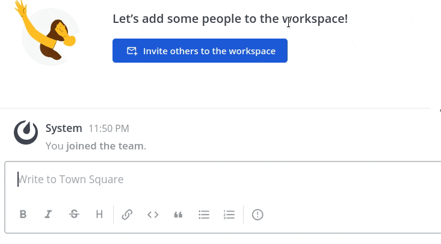

# Mattermost Spoiler Plugin [](https://github.com/moussetc/mattermost-plugin-spoiler/actions/workflows/main.yml)

**Maintainer:** [@moussetc](https://github.com/moussetc)

This plugin creates a slash command to display spoiler messages in a non-spoiling way.

## Usage

Type `/spoiler` followed by your spoiler, then post your message. The spoiler can be on more than one line, it can contain emojis, URLs, inline images, etc., they will be hidden . You can also add some context to your spoiler that will be always visible, by writing `/spoiler "Visible spoiler caption" Hidden spoiler content`.

Two display modes are available for spoiler messages:
- **Spoiler button** mode:  


- **Redacted** mode:  
  
***This mode is not available on native apps like Android.*** Native apps do not support UI customization, so for now they will use the *Spoiler button* mode.

> [!WARNING]  
> Plugin limitations: 
> - File attachments cannot be hidden, use inline images instead!
> - spoiler content cannot be edited once it's posted

## Compatibility

Use the following table to find the correct plugin version for each Mattermost server version:

| Mattermost server | Plugin release | Incompatibility |
| --- | --- | --- |
| 6.5 and higher | v4.0.x and higher | breaking plugin API changes |
| 5.39.0 and higher | v3.1.x | security fixes (upgrading dependencies) |
| 5.14 to 5.25 | v3.x.x | relative integration URLs |
| 5.3 to 5.13 | v2.x.x | |
| below | *not supported* |  plugins can't create slash commands |

## Installation and configuration

1. Download the [release package](https://github.com/moussetc/mattermost-plugin-spoiler/releases) and download the `.tar.gz` package. Supported platforms are: Linux x64, Windows x64, Darwin x64, FreeBSD x64.
2. Use the Mattermost `System Console > Plugins > Management` page to upload the `.tar.gz` package
3. **Activate the plugin** in the `System Console > Plugins > Management` page
4. Choose the display mode: go to the System Console > Plugins > Spoiler Command, select the mode and save the plugin's settings.  
 

### Configuration Notes in HA

If you are running Mattermost v5.11 or earlier in [High Availability mode](https://docs.mattermost.com/deployment/cluster.html), please review the following:

1. To install the plugin, [use these documented steps](https://docs.mattermost.com/administration/plugins.html#plugin-uploads-in-high-availability-mode)
2. Then, modify the config.json [using the standard doc steps](https://docs.mattermost.com/deployment/cluster.html#updating-configuration-changes-while-operating-continuously) to the following
```json
 "PluginSettings": {
        // [...]
        "PluginStates": {
            // [...]
            "com.github.moussetc.mattermost.plugin.spoiler": {
                "Enable": true,
		        "SpoilerMode": "button"
            },
        }
    }
```

## Development

To avoid having to manually install your plugin, build and deploy your plugin using one of the following options. In order for the below options to work, you must first enable plugin uploads via your config.json or API and restart Mattermost.

```json
    "PluginSettings" : {
        ...
        "EnableUploads" : true
    }
```

### Deploying with Local Mode

If your Mattermost server is running locally, you can enable [local mode](https://docs.mattermost.com/administration/mmctl-cli-tool.html#local-mode) to streamline deploying your plugin. Edit your server configuration as follows:

```json
{
    "ServiceSettings": {
        ...
        "EnableLocalMode": true,
        "LocalModeSocketLocation": "/var/tmp/mattermost_local.socket"
    },
}
```

and then deploy your plugin:
```
make deploy
```

You may also customize the Unix socket path:
```
export MM_LOCALSOCKETPATH=/var/tmp/alternate_local.socket
make deploy
```

If developing a plugin with a webapp, watch for changes and deploy those automatically:
```
export MM_SERVICESETTINGS_SITEURL=http://localhost:8065
export MM_ADMIN_TOKEN=j44acwd8obn78cdcx7koid4jkr
make watch
```

To speed up development, you can also set the following to only build for your current architecture:
```
MM_DEBUG=true
MM_SERVICESETTINGS_ENABLEDEVELOPER=true
```

### Deploying with credentials

Alternatively, you can authenticate with the server's API with credentials:
```
export MM_SERVICESETTINGS_SITEURL=http://localhost:8065
export MM_ADMIN_USERNAME=admin
export MM_ADMIN_PASSWORD=password
make deploy
```

or with a [personal access token](https://docs.mattermost.com/developer/personal-access-tokens.html):
```
export MM_SERVICESETTINGS_SITEURL=http://localhost:8065
export MM_ADMIN_TOKEN=j44acwd8obn78cdcx7koid4jkr
make deploy
```

## How do I share feedback on this plugin?

Feel free to create a GitHub issue or to contact me at `@cmousset` on the [community Mattermost instance](https://mattermost.com/community/) to discuss.
